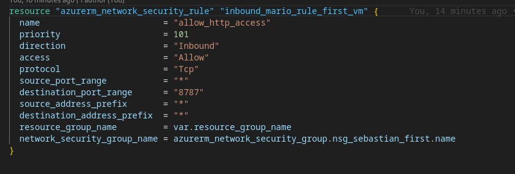
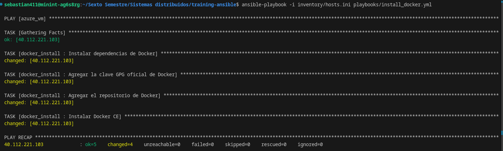
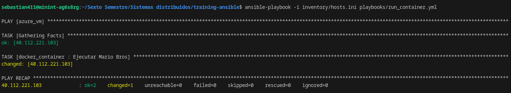
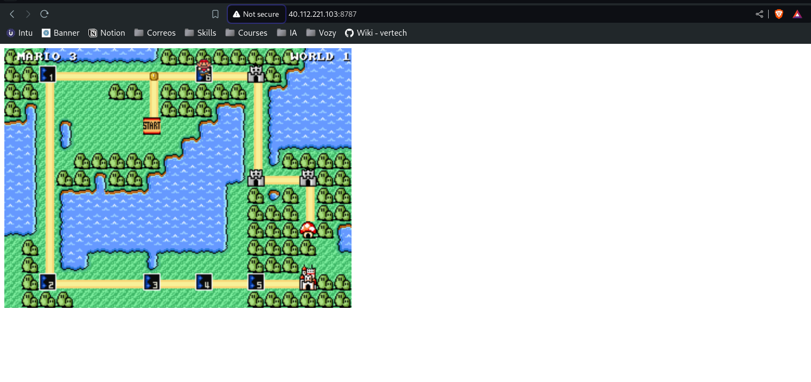

# Informe sobre el Despliegue de Ansible

## Introducción

En este informe, se detalla el proceso de despliegue de Ansible en una máquina virtual (VM) utilizando Terraform. Este despliegue fue realizado desde un repositorio modularizado que se puede encontrar en [este enlace](https://github.com/Sebastian-411/vm-terraform/tree/modularization). Un paso crucial para el éxito de este proceso fue la apertura del puerto 8787 en el grupo de seguridad de la VM.

## Descripción del Proceso

### Configuración Inicial

1. **Preparación de la Máquina Virtual**: 
   - Se utilizó Terraform para desplegar una máquina virtual.
   - Se abrió el puerto 8787 en el grupo de seguridad, permitiendo el acceso público.

    

2. **Instalación de Ansible**:
   - Antes de iniciar el despliegue, se debe tener Ansible descargado y la máquina virtual correctamente configurada.

### Modificación del Archivo de Inventario

3. **Archivo de Inventario**:
   - Localizamos el archivo de inventario ubicado en `inventory/hosts.ini`.
   - Se modificó la línea correspondiente a la dirección IP y credenciales de acceso. Para nuestro caso, se utilizó la IP `40.112.221.103` con las siguientes credenciales:
     - `ansible_user=adminuser`
     - `ansible_ssh_pass=P@ssw0rd1234`

### Ejecución de Playbooks

4. **Instalación de Docker**:
   - Ejecutamos el siguiente comando para instalar Docker en la máquina virtual:
     ```bash
     ansible-playbook -i inventory/hosts.ini playbooks/install_docker.yml
     ```
   - Al ejecutar este comando, deberíamos ver la siguiente salida:

   

5. **Ejecución del Contenedor**:
   - Posteriormente, para ejecutar el contenedor, se utiliza el siguiente comando:
     ```bash
     ansible-playbook -i inventory/hosts.ini playbooks/run_container.yml
     ```
   - La salida del comando debería ser similar a la siguiente:

   

### Acceso a la Aplicación

6. **Verificación del Acceso**:
   - Con el puerto 8787 abierto para acceso público, se puede acceder a la aplicación mediante la IP pública de la máquina virtual.
   - Al ingresar a `http://40.112.221.103:8787`, se debería visualizar la aplicación de Mario Bros en funcionamiento:

   

## Conclusión

El despliegue de Ansible en la máquina virtual fue exitoso, permitiendo la instalación y ejecución de Docker y el contenedor correspondiente. La apertura del puerto 8787 fue un paso esencial que facilitó el acceso a la aplicación desde el exterior. Este proceso demuestra la efectividad de utilizar herramientas como Terraform y Ansible para la automatización y gestión de infraestructuras en la nube.

